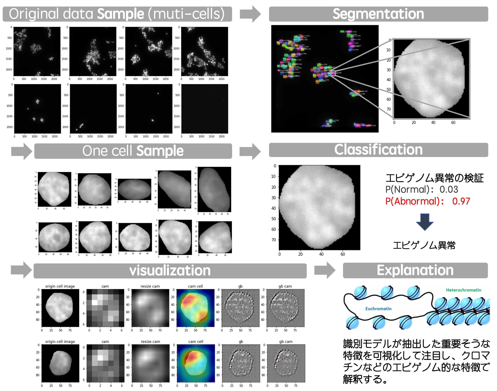
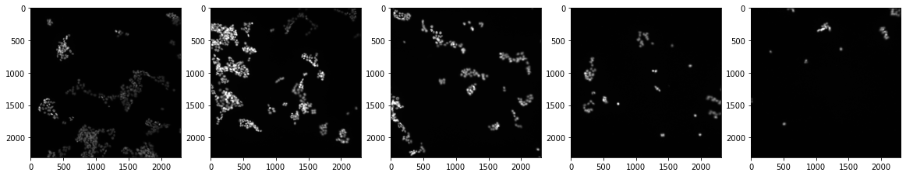
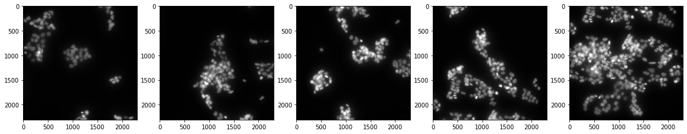
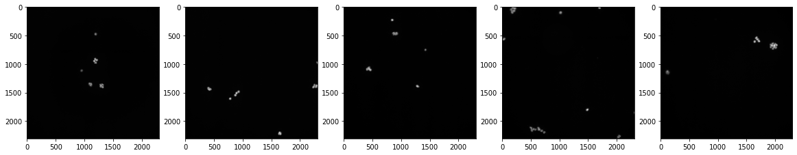
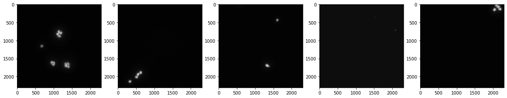
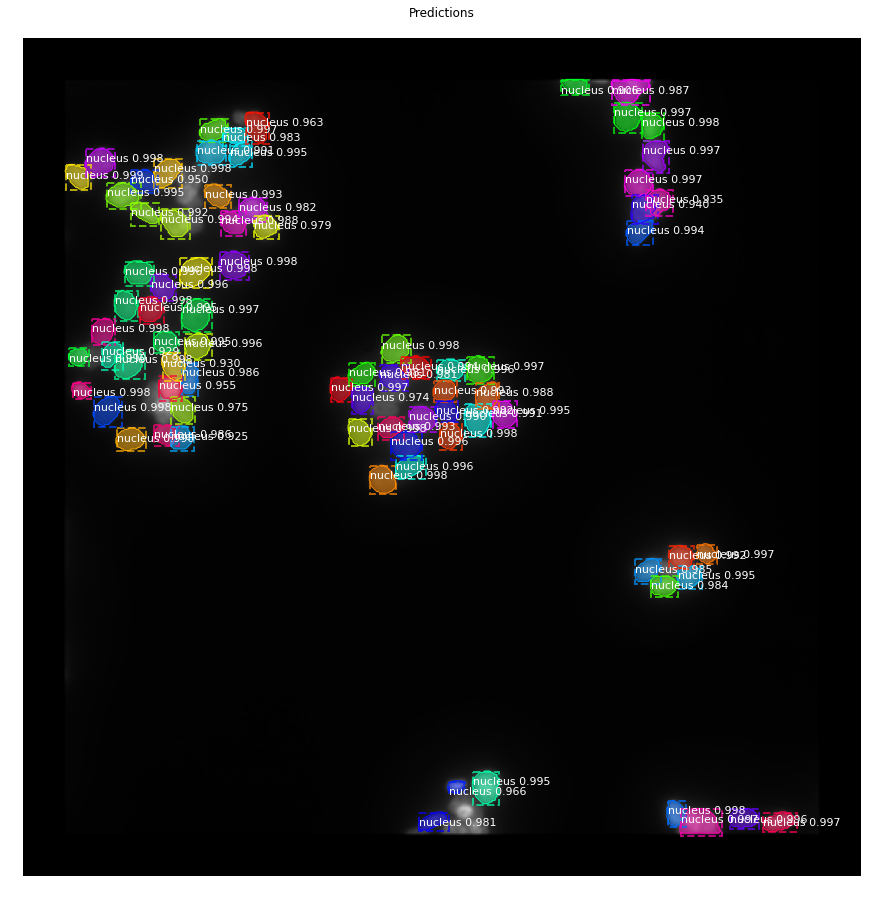
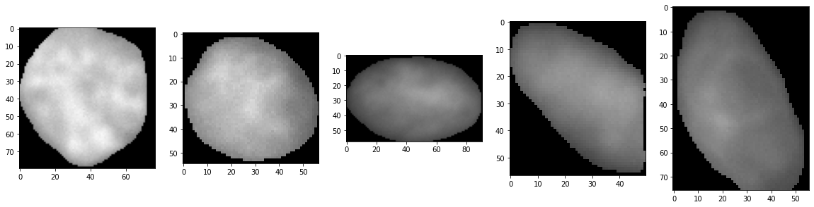
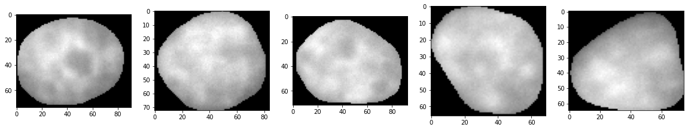
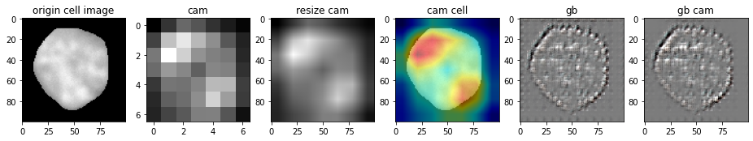
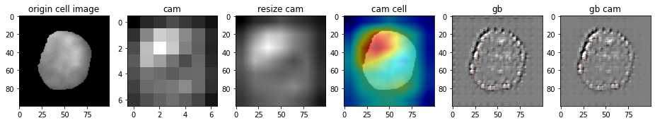

# NDAcquisition

* This is one of my research now in Saito Lab. The outline of this research is like figure below. The data is multiple cells, so first step is to split each cell and save as one cell image, next step is to classify with two classes that the cell is healthy or ill. Finally visualize extracted features that is express some important biology meaning, and explan them by biology knowedge like chromosome heterochromatin. 

  

## Data

* The data is not provided in public, the data sample is as following.

  * This is a piece of Z-stack telescope data that is made by Collaborator 光山先生. 
  * Two different label that the cell is sick or healthy(use medicine to cure the sick part)

 

## Instance Segmentation

* using maskrcnn

* Then get the new one cell datasets.

## Classification

* Using resnet18
* Using transformer

## Visualization and Explanation

* using the GradCAM and GuidedBackprop

  

  

